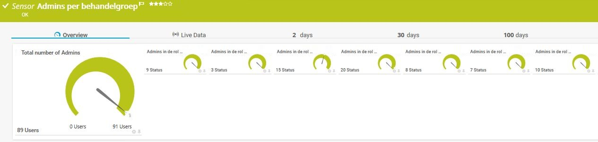

# **.SENSOR** Get-ADUserQuery_Sensor

## **.DESCRIPTION**

This script is meant to be used as EXE/XML PRTG-sensor. It will load in the ActiveDirectory Powershell
module, and uses Get-ADUser to query ActiveDirectory. This can be through a filter, LDAPFilter or where-
statement:

* *Get-Aduser -filter "Filter"*
* *Get-ADUser -LDAPfilter "Filter"*
* *Get-ADUser -filter \* | Where {filter}*

These filters are listed in a .Json formatted configurationfile. This file can also be used to
define the properties of the Get-ADUser cmdlet (Searchbase, Searchscope, Properties, what type
of filter to use)
The name of the configuration in the json-file should match the name of the channel in the
ChannelConfiguration XML-file. An example json and XML are given:

* Get-ADUserQuery_lockedusers.json
* Get-ADUserQuery_lockedusers.xml

The PRTG errormessage is either a custom message collected from the .Json, or the username
of the first user to hit the errorlimit. Errorvalues are collected from the ChannelConfiguration
XML-file

## **.FILES**

This sensor contains three files which should be placed in the **CustomSensors\EXEXML**-folder
in PRTG (usually \Program Files (x86)\PRTG Network Monitor\Custom Sensors\EXEXML):

* Get-ADUserQuery_Sensor.ps1
* Get-ADUserQuery_Configuration.json
* Get-ADUserQuery_ChannelConfiguration.xml

PRTG-module should be loaded in PRTG. ActiveDirectory module should be installed and loaded.
Configuration of the sensor object in PRTG is given in the synopsys of the sensor.

## **.PREREQUISITES**

The following prerequisites should be met:

* PRTG service-account must be allowed to load PRTG- and ActiveDirectory module
* PRTG service-account must be allowed to read ActiveDirectory

## **.TODO**

This sensor does not support multidomain scenario's... yet.

## **.ME**

This sensor is written by Jaap Plugge, OGD ict-diensten, for internal use @OGD.
It does not contain customer information. Free to use, no support provided

## **.VERSIONS**

* v. 1.0 - 06.08.2018 initial upload.
* v. 1.1 - 10.02.2019 added support for external domain.
* v. 1.2 - 07.07.2019 added custom error- en warningmessages
* v. 2.0 - 10.07.2022 move to github.
