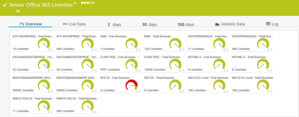

# **.SENSOR** Get-MSOL_License_Sensor

## **.DESCRIPTION**

This script is meant to be used as PRTG-sensor. It connects to Office 365 with the MSOL module,
using a serviceAccount (without MFA enabled). It there collects all different licenses available in the
tennant. These are compaired to the channels in the ChannelConfiguration XML-file.

Each license has two channels: 

* Licentienaam - Total licenses
* Licentienaam - Free licenses

The first channel lists the total amount of licenses; the second lists how many are available.
Warning- and Errorvalues can be set on the free licenses, to make sure sensor turns yellow or
red when licenses are running low.
Sensor will also alert if licenses are set to warning (when licenses are about to expire)
When a new license is introduced in the tennant, which is not aready in the XML-file, these will be
shown in the output of the sensor (when sensor is green).

Since MSOL powershell can only be loaded in an x64 Powershell, this sensor needs powershell x64 to run.
The Get-MSOLLicense_runner.ps1 starts the x64 process.

## **.FILES**

This sensor contains three files which should be placed in the **CustomSensors\EXEXML**-folder
in PRTG (usually \Program Files (x86)\PRTG Network Monitor\Custom Sensors\EXEXML):

* Get-MSOLLicense_Sensor.ps1
* Get-MSOLLicense_Runner.ps1
* Get-MSOLLicense_ChannelConfiguration.xml

*Licenses.json* is added purely as reference; the license displayNames and ID's of all licenses
Configuration of the sensor object in PRTG is given in the synopsys of the sensor.
PRTG-module should be loaded in PRTG.

## **.PREREQUISITES**

The following prerequisites should be met:

* A Msol / MS365 serviceAccount must be added to PRTG. This account must not have MFA enabled.
* This service-account must have 'Message Center Reader' rights in MS365
* The Microsoft Online Service Sign-in Assistant must be installed on the PRTG probe-server
* The Microsoft Online Powershell-module must be installed on the PRTG probe-server

## **.IMPORTANT**

The module used, MSOnline, is deprecated and due to be decommissioned December 2022. See [https://techcommunity.microsoft.com/..](https://techcommunity.microsoft.com/t5/microsoft-entra-azure-ad-blog/azure-ad-change-management-simplified/ba-p/2967456?WT.mc_id=M365-MVP-9501) for more info.

## **.ME**

This sensor is written by Jaap Plugge, OGD ict-diensten, for internal use @OGD.
It does not contain customer information. Free to use, no support provided

## **.VERSIONS**

* v. 1.0 - 24.08.2018 initiele upload.
* v. 1.1 - 18.11.2019 moved to ADO
* v. 1.2 - 14.11.2021 moved functions to PRTG Module
* v. 2.0 - 10.07.2022 moved to Github
