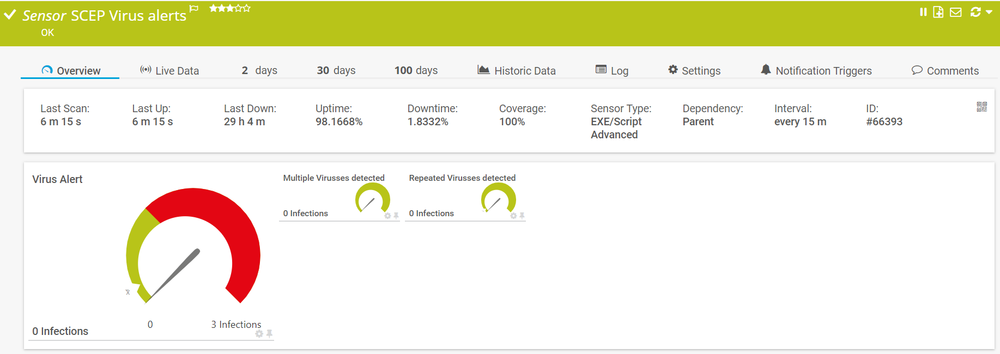
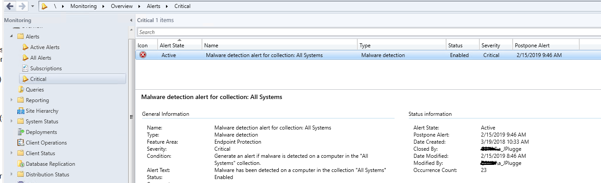

# **.SENSOR** Get-SCCMSCEP_Alerts

## **.DESCRIPTION**

This script is a PRTG sensor, meant to alert on SCEP / Defender alerts through SCCM. It
connects to the SCCM siteserver, and reads out the status alerts on the monitoring tab
*Alerts* - *Active Alerts*.
It will check for *malware detected*, *Repeated detections* en *Multiple detections*;
each of them has a seperate channel in the ChannelConfiguration.

## **.FILES**

This sensor contains two files which should be placed in the **CustomSensors\EXEXML**-folder
in PRTG (usually \Program Files (x86)\PRTG Network Monitor\Custom Sensors\EXEXML):

* Get-SCCMSCEPAlerts_sensor.ps1
* Get-SCCMSCEPAlerts_ChannelConfiguration.xml

PRTG-module should be loaded in PRTG.
Configuration of the sensor object in PRTG is given in the synopsys of the sensor.

## **.PREREQUISITES**

The following prerequisites should be met:

* The SCCM Siteserver can be reached from the PRTG Probe. This sensor reads the Siteservers WMI, NOT the Wsus- or Updatemanagement server
* The serviceAccount must have read-access to WMI on the Siteserver
* The serviceAccount must be at least "ReadOnly Analyst" in SCCM. (Buildin role)

## **.ME**

This sensor is written by Jaap Plugge, OGD ict-diensten, for internal use @OGD.
It does not contain customer information. Free to use, no support provided

## **.VERSIONS**

* v. 1.0 - 16.02.2019 initial upload.
* v. 1.1 - 14.11.2021 moved functions to PRTG Module
* v. 2.0 - 10.07.2022 moved to Github
