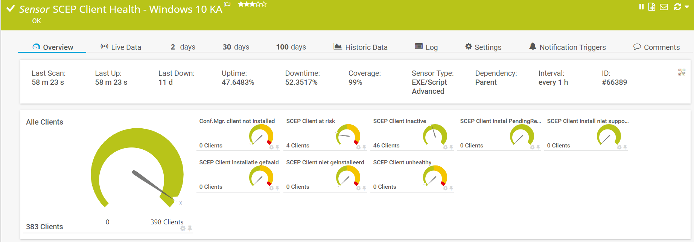

# **.SENSOR** Get-SCCMClientHealthStatus

## **.DESCRIPTION**

This script is ment to be run as PRTG-sensor. It connect to the SCCM siteserver through WMI.
It collects the status of SCEP / Defenders' working of a given collection (to which SCEP is deployed.)
through *Monitoring* - *Endpoint Protection*.

The collection used must be marked to appear in the SCEP dashboard. There is a checkmark under
*Alerts* **View this collection in the Endpoint Protection dashboard**, which has to be activated

Sensor shows:

* SCEP Client installation failed
* SCEP Client install PendingReboot
* SCEP Client not installed
* SCEP Client install not supported (for all those linux clients out there)
* SCEP Client inactive
* Conf.Mgr. client not installed
* SCEP Client unhealthy
* SCEP Client at risk

Sensor does **not** show active alerts. Get-SCCMScepAlerts is meant for active alerts!

## **.FILES**

This sensor contains two files which should be placed in the **CustomSensors\EXEXML**-folder
in PRTG (usually \Program Files (x86)\PRTG Network Monitor\Custom Sensors\EXEXML):

* Get-SCCMClientHealthStatus_sensor.ps1
* Get-SCCMClientHealthStatus_channelConfiguration.xml

PRTG-module should be loaded in PRTG.
Configuration of the sensor object in PRTG is given in the synopsys of the sensor.

## **.PREREQUISITES**

The following prerequisites should be met:

* The SCCM Siteserver can be reached from the PRTG Probe. This sensor reads the Siteservers WMI, NOT the Wsus- or Updatemanagement server
* The serviceAccount must have read-access to WMI on the Siteserver
* The serviceAccount must be at least "ReadOnly Analyst" in SCCM. (Buildin role)

## **.ME**

This sensor is written by Jaap Plugge, OGD ict-diensten, for internal use @OGD.
It does not contain customer information. Free to use, no support provided

## **.VERSIONS**

* v. 1.0 - 16.02.2019 initial upload.
* v. 1.1 - 14.11.2021 moved functions to PRTG Module
* v. 2.0 - 10.07.2022 moved to Github
