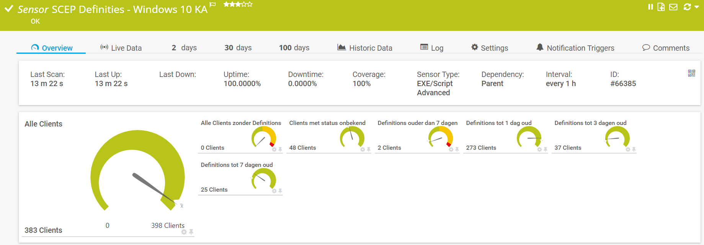
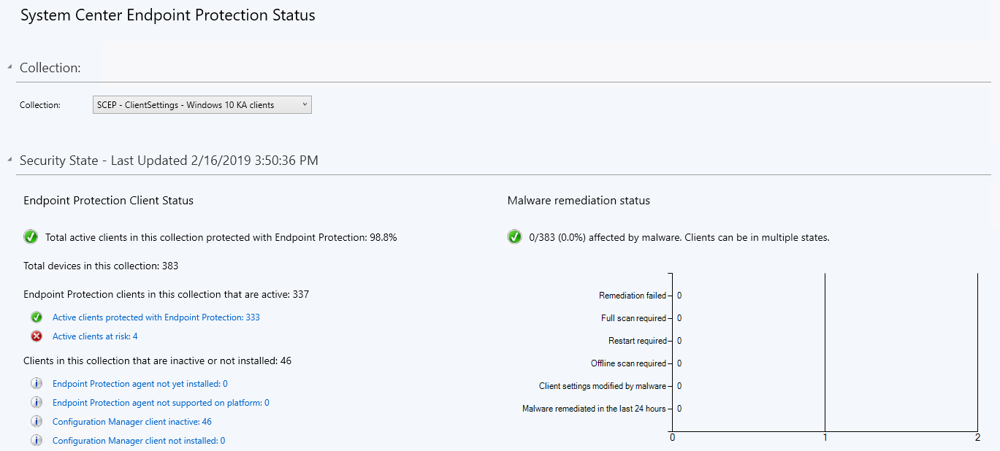

# **.SENSOR** Get-SCCMSCEP_DefinitionStatus

## **.DESCRIPTION**

This script is ment to be used as a PRTG-sensor. It connects to an SCCM Siteserver through WMI,
and collects the status of the SCEP definitions deployed to a certain collection. It basically
shows **Monitoring** - **Endpoint Protection** in the SCCM Console.

It filters out the age of the definitionfiles of the clients in the collection, and shows them in
the channels:

* All Clients
* All Clients without SCEPClient
* All Clients without Definitions
* Definitions older than 7 days
* Definitions less than 7 days old
* Definitions less than 3 days old
* Definitions less than 1 days old

The collection used must be marked to appear in the SCEP dashboard. There is a checkmark under
*Alerts* **View this collection in the Endpoint Protection dashboard**, which has to be activated

Sensor does **not** show active alerts on virusses. Get-SCCMScepAlerts is meant for active alerts!

## **.FILES**

This sensor contains two files which should be placed in the **CustomSensors\EXEXML**-folder
in PRTG (usually \Program Files (x86)\PRTG Network Monitor\Custom Sensors\EXEXML):

* Get-SCCMClientDefinitionStatus_sensor.ps1
* Get-SCCMClientDefinitionStatus_channelConfiguration.xml

## **.PREREQUISITES**

The following prerequisites should be met:

* The SCCM Siteserver can be reached from the PRTG Probe. This sensor reads the Siteservers WMI, NOT the Wsus- or Updatemanagement server
* The serviceAccount must have read-access to WMI on the Siteserver
* The serviceAccount must be at least "ReadOnly Analyst" in SCCM. (Buildin role)

## **.ME**

This sensor is written by Jaap Plugge, OGD ict-diensten, for internal use @OGD.
It does not contain customer information. Free to use, no support provided

## **.VERSIONS**

* v. 1.0 - 16.02.2019 initial upload.
* v. 1.1 - 14.11.2021 moved functions to PRTG Module
* v. 2.0 - 10.07.2022 moved to Github
