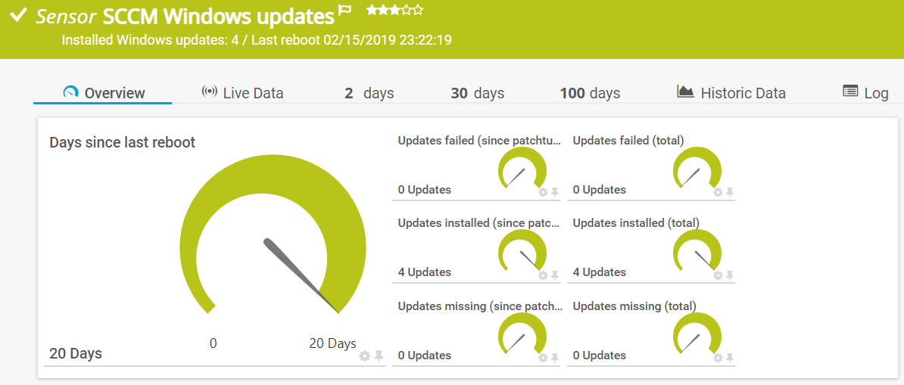

# **.SENSOR** Get-SCCMUpdateStatus

## **.DESCRIPTION**

This SCCM sensor is not meant to be deployed to the SCCM Siteserver or Windows update point. It is meant for SCCM
managed servers. It connects to the local WMI, of the local SCClient, and collects the maintenancewindows listed
in the client. It also collects the active deployments of updates to this client. (so updates shown in Software-
center of the targetted server). Based on these maintenancewindows, and the time of the month, it calculates:

* Any updates failed since last maintenancewindow: *Alert*
* Any updates pending since last maintenancewindow:
  * If next maintenancewindow is before next patchtuesday: *All is well*
  * If next maintenancewindow is after next patchtuesday: *Previous maintancewindow should have installed the updates: Alert*
  * If next maintenancewindow is today: *Show in message*
  * If patchtuesday is today: *Show in message*

This sensor does not need specific configuration in the ChannelConfiguration XML; one configfile will serve all servers.
I use it to monitor update installation instead of the default "Windows update" sensor.

## **.FILES**

This sensor contains two files which should be placed in the **CustomSensors\EXEXML**-folder
in PRTG (usually \Program Files (x86)\PRTG Network Monitor\Custom Sensors\EXEXML):

* Get-SCCMUpdateStatus_Sensor.ps1
* Get-SCCMUpdateStatus_ChannelConfiguration.xml

PRTG-module should be loaded in PRTG.
Configuration of the sensor object in PRTG is given in the synopsys of the sensor.

## **.ME**

This sensor is written by Jaap Plugge, OGD ict-diensten, for internal use @OGD.
It does not contain customer information. Free to use, no support provided

## **.VERSIONS**

* v. 1.0 - 03.04.2019 initial upload.
* v. 1.1 - 18.11.2021 moved functions to PRTG Module
* v. 2.0 - 10.07.2022 moved to Github
